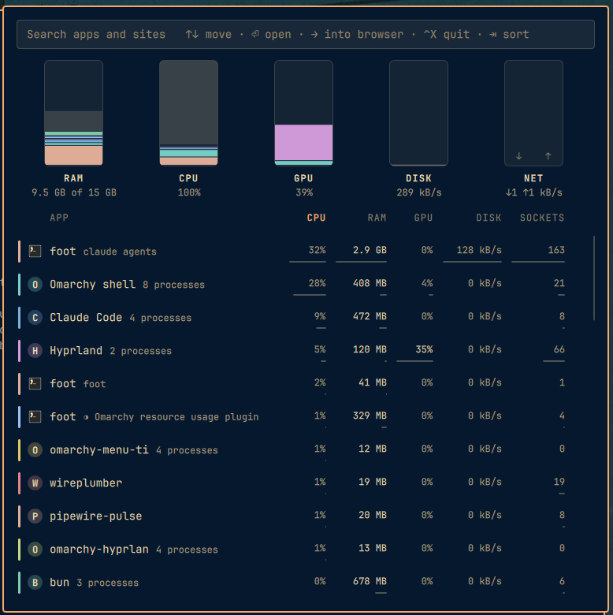

# omatop

Who is eating the laptop. A bar widget for the [Omarchy](https://omarchy.org/)
shell that answers one question when you click it: which app, and inside
Chromium which site, is holding the memory and burning the CPU right now,
with a way to close it from the same row.



`htop` shows twenty-three rows called `chromium`. This shows one row called
Chromium that opens into `cursor.com 1.7 GB`, `wikipedia.org 42 MB`,
`Extensions 200 MB`, `Browser core 970 MB`.

## What you see

- **Bar:** the icon is a small tank. Its fill is the share of RAM in use,
  from a cheap sample every twenty seconds. Calm machines draw it quietly,
  busy ones (RAM over 75% or load over half the cores) at full strength, and
  when the CPU is saturated or memory is nearly gone it takes the bar's
  active colour and breathes slowly. A click squashes it and the liquid
  settles back. Hover shows "CPU 45% · RAM 9.5 GB" and nothing else. Middle
  click posts that as a notification. Right click opens btop.
- **Panel (left click):** a search field on top, five gauges standing in a
  row under it, and a list of up to fifty apps that scrolls. Each gauge is
  one resource, RAM, CPU, GPU, DISK, NET, filled from the bottom by app,
  every app in its own colour, with the machine's figure captioned below.
  Read together they are a skyline: the tallest fill is the pressure and
  the colours say who, before any number. Each gauge holds one segment per
  row on screen; everything below the fold folds into one quiet block. The
  same colour marks the app's row. Hover a row or a segment and the gauges
  dim to that one app, ribbons in its colour join its segment across the
  strip, and every caption turns into that app's own figure. The RAM
  caption also carries a trend word from the last half hour, "climbing",
  as an arrow: ↗ climbing, → steady, ↘ falling. Pointing at the grey block
  in a gauge, the part no row on screen accounts for, relabels the gauges
  OTHER with that remainder. Every number in the list sits over a hairline
  scaled to the column's largest value, so a column reads as a chart.
  Nothing is blank: a quiet 0 is a real zero, and DISK carries its unit.
  SOCKETS is the network column's honest name.
- **Omarchy web apps** are Chromium windows, but they live on the desktop
  as apps, so they are listed as apps: their own row, their own colour,
  the app's icon with a small Chromium badge, and the Chromium row holds
  what is left ("3 pages · 1 Omarchy app above").
- **Sort and search.** Type to filter by name or title. Click a column
  title, or press Tab, to sort by CPU, RAM, GPU, DISK, NET or name; the
  choice is saved to shell.json.
- **Enter or a click** on an app brings its window to the front (btop if it
  has none). On a browser it drills into a view of only that browser's
  pages.
- **The browser view** lists every page the browser holds, with its
  favicon straight out of Chromium's own cache, and one row for the browser
  itself (extensions, GPU, network, background pages). The gauges become the
  browser's, scaled to its own totals. Enter or a click on a page brings
  that tab, or web-app window, to the front. Esc, the left arrow, or the
  header row go back. A page row is one origin across all its tabs and
  windows. Web apps are not repeated here; they have their own rows in
  the app list.
- **Closing:** the × on the row under the cursor, or Ctrl+X. One
  confirmation, which names what closes and roughly what it frees. Sites are
  closed through DevTools, so the tab goes away cleanly. Apps get SIGTERM;
  if one is still there five seconds later the row says so and a second
  Ctrl+X offers a force kill. The shell, Hyprland and the session plumbing
  are listed but never offered.

Keys, all from the search field: type to search, `↑` `↓` (or Ctrl+J/K)
move, `Enter` go, `→` into a browser, `←` back out, `Tab` sort, `Ctrl+X`
close, `Esc` clears the search, then backs out, then dismisses. The
placeholder text says as much, and gets out of the way when you type.

## How it knows which site is which

Chromium does not put the site in a renderer's command line. The only clean
source is the DevTools protocol: attaching to a page and starting a
zero-length trace returns a `TracingStartedInBrowser` event that lists the
page's frames with their OS process ids. That takes about 50 ms per page,
is cached per tab, and is redone only when a tab navigates or its renderer
goes away.

For that to work Chromium has to expose DevTools locally, with one flag
in `~/.config/chromium-flags.conf`:

```
--remote-debugging-port=0
```

Port zero means Chromium picks a random port and writes it to
`~/.config/chromium/DevToolsActivePort`, which the collector reads. It is
bound to 127.0.0.1. Any process running as you can already read your
profile directory, so this does not widen what a local process could do;
it is still a debugging endpoint, so remove the line if that trade is not
for you. Without it the panel still works, at app level, and the browser
row says that sites appear after a restart.

Memory is PSS from `smaps_rollup` for the heaviest 32 processes and RSS for
the rest, so Chromium's shared pages are counted once. CPU is the classic
per-core percent from `/proc/<pid>/stat` deltas, summed per app.

Disk is bytes actually read and written per process from `/proc/<pid>/io`,
as a rate, against the machine's own rate from `/proc/diskstats`.

GPU comes from the DRM driver's per-client counters in `/proc/<pid>/fdinfo`
(the i915 `drm-engine-*` busy times), so it is per process without root,
for the sixty heaviest processes. The GPU tank's total is one full engine.

Network is the one thing the kernel will not give an unprivileged reader
per process: byte counts per socket need root or eBPF. So the NET column is
the number of open sockets per app, which still points at who is talking,
and the hero shows the machine's own receive and send rate.

## Install

```bash
omarchy plugin add https://github.com/apurvasaraiya/omarchy-omatop.git --enable
```

That puts the tank in the bar. For the page view inside Chromium, open the
panel, press Enter on the Chromium row, and press Enter again on the note
that says "turn on the page view": it appends `--remote-debugging-port=0`
to `~/.config/chromium-flags.conf`. Restart Chromium once. Without it the
panel still works at app level. (`python3 ~/.config/omarchy/plugins/apurva.omatop/omatop setup`
does the same from a shell.)

Requirements: Omarchy 4 (the shell with plugins), Python 3, and for the page
view a Chromium-based browser using the default profile directory. Nothing
to install.

For development, link a checkout instead so edits land live:

```bash
git clone https://github.com/apurvasaraiya/omarchy-omatop.git ~/dev/omarchy/omatop
~/dev/omarchy/omatop/install.sh
```

Settings, in the widget's entry in `~/.config/omarchy/shell.json`:

- `sort` (default `mem`): written for you when you click a column title.
- `maxApps` (default 50): how many apps the list holds.
- `visibleRows` (default 11): how many rows show before it scrolls.
- `card: false` if your bar draws per-widget cards and you would rather it
  did not around this one.

To remove: `omarchy plugin remove apurva.omatop`, and delete the
`--remote-debugging-port=0` line from `~/.config/chromium-flags.conf` if you
added it. The plugin keeps no state outside `$XDG_RUNTIME_DIR`, which the
system clears at logout.

A keybind, in `~/.config/hypr/bindings.lua`:

```lua
o.bind("SUPER + SHIFT + T", "Omatop", "omarchy-shell apurva.omatop toggle")
```

## What this touches on the system

- Reads `/proc` for your own processes, the machine's memory, load, network
  and disk counters, your web-app launchers in
  `~/.local/share/applications`, and, when the page view is on, Chromium's
  DevTools endpoint over 127.0.0.1 plus a read-only copy of its favicon
  database.
- Writes favicon PNGs and that database copy to
  `$XDG_RUNTIME_DIR/omatop-<uid>/icons/` (private directory, exclusive
  temp files then rename). Writes one line to `chromium-flags.conf` only
  when you ask for the page view. Writes your sort choice to `shell.json`
  through the shell's own API.
- Runs `hyprctl` to focus windows, `btop` and a notification when asked,
  and `kill` on your own processes after you confirm.
- No network beyond the loopback DevTools socket. No telemetry.

The DevTools endpoint is a debugging interface bound to localhost. Any
process running as you could already read your Chromium profile, so it does
not widen what a local process could do, but it is a debugging endpoint;
leave the page view off if that trade is not for you.

## Files

- `omatop` - the collector and the actions. Python 3, standard library only.
  `omatop watch --interval 2` streams one JSON snapshot per line;
  `omatop close-site` and `omatop kill` are what the confirmation runs.
- `BarWidget.qml` - the bar glyph and the panel's host.
- `Panel.qml` - the breakdown.
- `Model.js` - formatting, the hero sentence, row flattening. No QML in it.

Built and verified against omarchy `4.0.0.r2014` (September 2026).
MIT licence. Issues and pull requests at
https://github.com/apurvasaraiya/omarchy-omatop.
